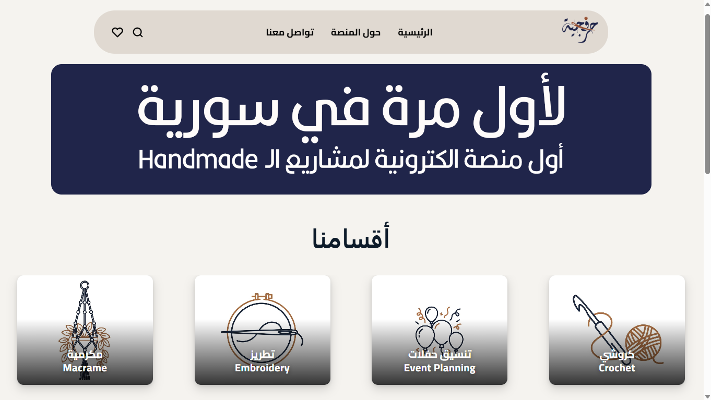
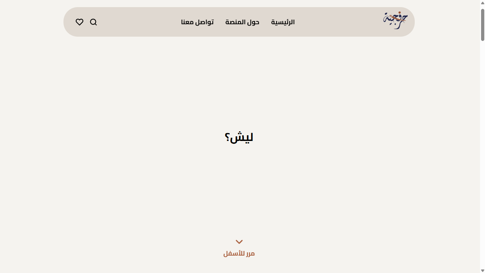
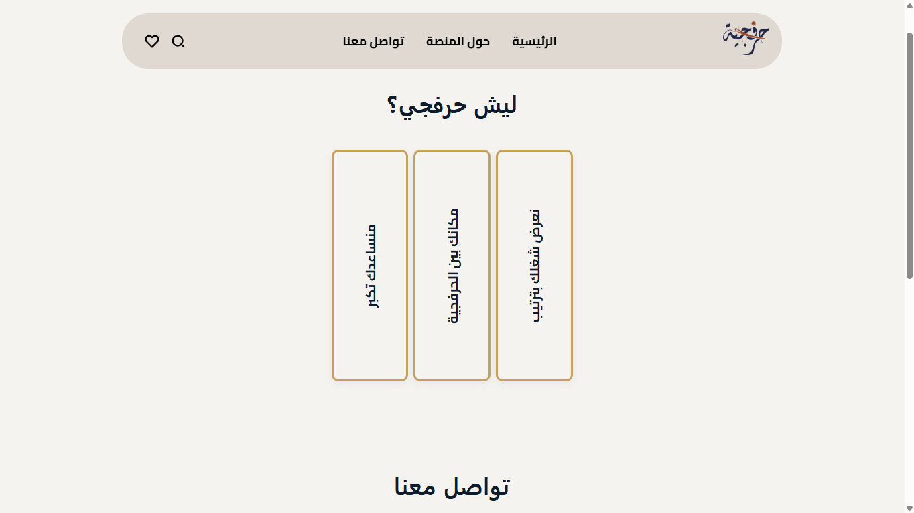

# Harafjeya Website

A clean and elegant showcase of the Harafjeya platform.

---

## Tech Stack
- HTML
- CSS
- JavaScript

---

## Features
- Elegant layout
- User-friendly interface
- Clean design presentation

---

## Live Demo
[Visit Harafjeya](https://harafjeya.com)

---

## Screenshots

### Home Page

  

### About Page

  

### Contact / Dashboard Page

  

---

## Social Media
- Instagram: [@harafjya](https://www.instagram.com/harafjya/)
- Facebook: [Harafjeya](https://www.facebook.com/profile.php?id=61586683182284)